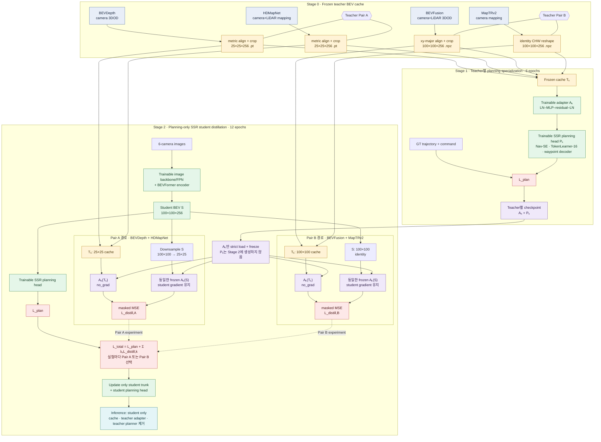

# Planning-Centric BEV Distillation 실험 계획
(BEVDepth·HDMapNet 및 BEVFusion·MapTRv2)

## 1. 연구 목적

본 연구의 목적은 3D object detection과 online mapping에 특화된 teacher의
BEV 표현을 이용해, SSR student의 BEV가 단순한 image-to-BEV 표현을 넘어
planning에 더 유용한 표현을 갖도록 학습시키는 것이다.

Teacher는 detection/mapping 쌍을 두 세트로 사용한다.

- 쌍 A (기존): BEVDepth (3D detection) + HDMapNet LiDAR+Camera (online mapping)
- 쌍 B (추가): BEVFusion (C+L detection) + MapTRv2 (camera mapping)

쌍 A는 이 머신의 teacher 저장소와 `.pt` 25x25 cache를 쓴다. 쌍 B는 teacher
저장소 없이, 다른 서버에서 만든 100x100 `.npz` cache만 사용한다. 자세한
경로는 12절.

쌍 A checkpoint:

```text
/data2/byounggun/rideflux/pretrained_checkpoints/
  bevdepth_nuscenes_r50_256x704_cbgs.pth
  hdmapnet_nuscenes_60x30_lidar_camera.pth
```

Teacher의 원래 detection/map head가 직접 student를 지도하는 방식은 사용하지
않는다. 대신 각 teacher BEV 위에 작은 adapter와 SSR planning head를 먼저
학습해, teacher의 task-specific BEV에서 실제 planning에 필요한 부분을
추출하는 planning-centric feature space를 만든다. 이후 student BEV가 이
feature space에 가까워지도록 distillation한다.

## 2. 핵심 가설

주 가설은 다음과 같다.

> Detection과 mapping teacher의 BEV를 planning supervision으로 한 번
> 정제한 adapter space에 student BEV를 정렬하면, student가 detection/map
> auxiliary head를 직접 학습하지 않아도 planning에 유용한 객체·도로 구조
> 정보를 BEV encoder에 내재화할 수 있다.

세부 가설은 다음과 같다.

1. BEVDepth teacher는 동적 객체의 위치, 크기, 방향과 같은 collision-aware
   정보를 student BEV에 제공한다.
2. HDMapNet teacher는 차선, 경계와 같은 route- and topology-aware 정보를
   student BEV에 제공한다.
3. 두 teacher를 함께 사용하면 서로 다른 task의 정보가 보완적으로 작용한다.
4. Teacher adapter를 student 학습 중 동결하면, adapter가 loss를 쉽게 줄이는
   방향으로 변하는 것을 막고 distillation gradient를 student BEV encoder에
   직접 전달할 수 있다.

## 3. 전체 방법



학습은 teacher BEV cache 생성, teacher adapter 사전학습, student distillation의
세 단계로 나눈다. Pair A와 Pair B는 대체 teacher 조합이며 한 Student run에서
네 teacher를 동시에 사용하는 설정이 아니다.

## 4. Stage 0: Frozen teacher BEV cache 생성

### 4.1 Feature tap

Teacher의 최종 prediction이 아니라 task head 바로 앞의 256-channel BEV를
사용한다.

| Teacher | Feature tap | 원본 크기 | 의미 |
| --- | --- | --- | --- |
| BEVDepth | `model.head.neck` | `256 x 128 x 128` | detection head가 사용하는 BEV FPN feature |
| HDMapNet | `model.bevencode.up1` | `256 x 100 x 200` | semantic/instance/direction map head가 공유하는 BEV feature |

모든 teacher parameter는 `requires_grad=False`, `eval()` 상태로 두고
`torch.no_grad()`에서 feature를 추출한다. Teacher를 매 student iteration마다
실행하지 않고 sample token 기준 cache로 저장해 teacher 환경과 SSR 환경의
legacy dependency 충돌 및 학습 연산량 증가를 피한다.

### 4.2 좌표계 정렬

Teacher feature는 nuScenes ego 좌표계인 `x=전방, y=좌측`을 사용하고,
SSR BEV는 LIDAR_TOP 좌표계인 `x=우측, y=전방`을 사용한다. 따라서 다음
고정 변환을 적용한다.

```text
teacher_x = ssr_y
teacher_y = -ssr_x
```

즉 x/y 축을 교환하고 teacher y축 부호를 반전한다. 그 뒤 SSR 범위
`x=[-15, 15], y=[-30, 30]`로 metric resampling하고 `25 x 25 x 256`
fp16 feature로 저장한다.

Cache에는 feature뿐 아니라 유효 영역 mask와 checkpoint hash, feature tap,
좌표 변환 정보가 포함된 manifest를 함께 저장한다.

## 5. Stage 1: Teacher별 planning adapter 사전학습

### 5.1 학습 구조

각 teacher마다 서로 독립적인 branch를 구성한다.

```text
cached teacher BEV
  -> residual two-layer per-cell MLP adapter
  -> fixed bilinear resize: 25x25 -> 100x100
  -> SSR navigation SE gate
  -> TokenLearner, 16 scene tokens
  -> SSR latent decoder
  -> SSR waypoint decoder
  -> 3-command x 6-step trajectory
```

Adapter는 공간 convolution을 쌓는 복잡한 구조가 아니라 각 BEV cell에
동일하게 적용되는 작은 residual MLP다.

```text
LayerNorm(256)
-> Linear(256, 256)
-> GELU
-> Linear(256, 256)
-> residual connection
-> LayerNorm(256)
```

마지막 Linear는 zero initialization하여 초기 adapter가 normalized identity에
가깝게 동작하도록 한다.

### 5.2 학습 대상과 loss

Teacher encoder와 기존 detection/map parameter는 업데이트하지 않는다.
Cache를 사용하므로 이 parameter들은 Stage 1 model에도 포함되지 않는다.

전체 실험에서 학습되는 parameter는 다음 네 그룹뿐이며, 실제 실행은 두 개의
독립 DDP job으로 나눈다.

```text
GPU 0,1 job: BEVDepth adapter + BEVDepth용 SSR planning head
GPU 2,3 job: HDMapNet adapter + HDMapNet용 SSR planning head
```

각 job의 model에는 선택한 teacher branch 하나만 생성된다. 따라서 BEVDepth
job에는 HDMapNet parameter가, HDMapNet job에는 BEVDepth parameter가 존재하지
않는다.

Teacher `k`의 Stage 1 loss는 commanded trajectory branch에 대한 SSR L1
planning loss다. 두 teacher는 각각 독립된 2-GPU 작업으로 학습한다.

```text
Z_k = A_k(T_k)
Y_k = P_k(Z_k, command)
L_stage1,k = L_plan(Y_k, Y_gt)
```

여기서 `T_k`는 frozen teacher cache, `A_k`는 adapter, `P_k`는 teacher별
SSR planning head다. 이 학습으로 `A_k(T_k)`가 teacher task feature 중
planning과 직접 관련된 정보를 강조하는 공간이 되도록 유도한다.

### 5.3 기본 학습 설정

| 항목 | 기본값 |
| --- | --- |
| Epoch | 6 |
| Global batch | 8 |
| Optimizer | AdamW |
| Learning rate | `2e-4` |
| Weight decay | `0.01` |
| Cache resolution | `25 x 25` |
| Planning resolution | `100 x 100` |
| Teacher branch loss weight | 각각 `1.0` |
| BEVDepth job | GPU `0,1`, global batch `8` (`4 x 2`) |
| HDMapNet job | GPU `2,3`, global batch `8` (`4 x 2`) |

매 epoch teacher별 checkpoint를 따로 저장한다. Stage 2에는 두 Stage 1
checkpoint에서 adapter만 불러와 동결한다. 학습이 끝난 teacher planning head도
checkpoint에 고정된 채 보존되지만 student model에는 생성하거나 복사하지 않는다.
Stage 2 loss는 planning-head prediction이 아니라 고정 adapter 출력끼리 계산한다.

## 6. Stage 2: Planning-only SSR student distillation

### 6.1 Student 구조

Student는 `/data2/byounggun/rideflux/ssr_noffp_2gpu_b4` 실험과 동일한 목적의
planning-only 구조다.

- Image backbone/FPN: 학습
- BEVFormer encoder: 학습
- SSR planning head: 학습
- Detection/motion head: 없음
- Mapping head: 없음
- Occupancy head: 없음
- FFP/latent world model: 없음
- Distillation adapter: 학습 중 동결, inference에서는 불필요

Student의 일반 planning 경로는 기존 SSR planning head를 그대로 사용한다.

### 6.2 Distillation 경로

Student의 `100 x 100 x 256` BEV를 fixed bilinear downsampling하여 teacher
cache와 같은 `25 x 25 x 256` 크기로 만든다. Teacher별로 Stage 1에서 학습된
adapter를 하나씩 복원한다.

중요한 점은 teacher와 student를 처리하는 adapter가 동일한 module instance라는
것이다. Adapter parameter는 동결하지만, student input에 대한 autograd graph는
유지한다.

```text
Z_teacher,k = stop_gradient(A_k(T_k))
Z_student,k = A_k(Downsample(S))
```

유효 BEV cell에 대해서만 masked mean squared error를 계산한다.

```text
L_distill,k = MaskedMSE(Z_student,k, Z_teacher,k)

L_total = L_plan
        + lambda_bevdepth * L_distill,bevdepth
        + lambda_hdmapnet * L_distill,hdmapnet
```

기본값은 `lambda_bevdepth=1.0`, `lambda_hdmapnet=1.0`이다. Feature가
LayerNorm을 통과하므로 loss 절대값만으로 세기를 판단하지 않고, 실제
`dL/d(student BEV)` gradient norm과 share를 함께 확인한다.

Adapter를 동결하는 이유는 별도의 trainable student adapter가 teacher 공간에
맞춰지는 것만으로 loss가 줄어드는 해를 방지하기 위해서다. 현재 구조에서는
distillation loss를 줄이려면 student BEV encoder가 바뀌어야 한다.

### 6.3 기본 학습 설정

| 항목 | 기본값 |
| --- | --- |
| Epoch | 12 |
| Global batch | 8 |
| Optimizer | AdamW |
| Learning rate | `5e-5` |
| Weight decay | `0.01` |
| Planning loss weight | `1.0` |
| BEVDepth distill weight | `1.0` |
| HDMapNet distill weight | `1.0` |
| Distillation adapter | Teacher별 Stage 1 weight를 strict load한 뒤 동결 |

여기서 “adapter끼리 distillation”은 별도의 trainable student adapter와
teacher adapter의 weight를 맞추는 방식이 아니다. Teacher cache와 student BEV를
teacher별로 동일한 frozen adapter instance에 통과시키고, 두 adapter 출력
feature를 맞춘다. 이 때문에 adapter가 loss를 대신 흡수하지 못하고 gradient가
student BEV encoder까지 전달된다. Teacher planning head는 Stage 1 checkpoint에
보존되지만 Stage 2에서는 생성하지 않으므로 gradient와 optimizer 대상에서 모두
제외된다.

## 7. 실험군

모든 실험은 seed, initialization, global batch, learning rate, epoch,
evaluation checkpoint 정책을 동일하게 유지한다.

| ID | 설정 | 목적 |
| --- | --- | --- |
| E0 | 기존 `ssr_noffp_2gpu_b4` 결과 | 기존 reference 확인 |
| E1 | 현재 코드의 planning-only SSR, distillation 없음 | 코드베이스와 일정이 완전히 같은 control |
| E2 | BEVDepth adapter distillation만 사용 | detection teacher의 단독 효과 |
| E3 | HDMapNet adapter distillation만 사용 | mapping teacher의 단독 효과 |
| E4 | BEVDepth + HDMapNet 동시 사용 | 주 실험 및 상호 보완 효과 |
| E5 | 두 teacher token을 무작위로 섞어서 사용 | sample-aligned knowledge가 원인인지 확인하는 negative control |

핵심 결과가 확인되면 다음 추가 ablation을 수행한다.

| ID | 설정 | 확인할 내용 |
| --- | --- | --- |
| A1 | adapter 없이 raw teacher BEV 직접 distillation | planning-specialized adapter의 필요성 |
| A2 | student-side adapter를 별도로 두고 학습 | frozen shared adapter 설계의 효과 |
| A3 | cache resolution `12x12`, `25x25`, `50x50` | 공간 해상도와 저장량/성능 trade-off |
| A4 | distill weight `0.25`, `0.5`, `1.0`, `2.0` | planning gradient와 teacher gradient 균형 |
| A5 | Stage 1을 1/3/6 epoch 학습 | adapter의 planning specialization 정도 |

## 8. 평가 지표

최종 성능 판단은 SSR과 동일한 planning 평가를 사용한다.

- MAX/UniAD: `plan_L2_stp3_1s`, `plan_L2_stp3_2s`,
  `plan_L2_stp3_3s`, `plan_L2_stp3_avg`
- AVG/VAD: `plan_L2_1s`, `plan_L2_2s`, `plan_L2_3s`, `plan_L2_avg`
- `plan_obj_col_1s`, `plan_obj_col_2s`, `plan_obj_col_3s`
- `plan_obj_box_col_1s`, `plan_obj_box_col_2s`, `plan_obj_box_col_3s`
- 전체 평균과 command별 성능

코드의 두 L2는 다음처럼 해석한다.

| 로그 key | 계산 | 사용 |
| --- | --- | --- |
| `plan_L2_stp3_ts` | 정확히 t초의 마지막 waypoint L2, 즉 endpoint/MAX | SSR·UniAD headline 비교용 주 지표 |
| `plan_L2_ts` | 0.5초부터 t초까지 waypoint L2 평균 | VAD식 AVG 보조 지표 |

`stp3`라는 key 이름은 과거 코드에서 유지된 이름이며 실제 계산은 ST-P3 전용
metric이 아니라 horizon 마지막 frame의 endpoint error다. SSR 논문의 대표
`L2 0.75`는 `plan_L2_stp3_avg`에 대응한다. 각 `*_avg`는 1s, 2s, 3s 세
horizon 결과의 산술평균이며 두 지표 모두 낮을수록 좋다.

학습 메커니즘 확인을 위해 다음 값을 함께 기록한다.

- `loss_plan_reg`
- `loss_distill_bevdepth`, `loss_distill_hdmapnet`
- `distill_cos/bevdepth`, `distill_cos/hdmapnet`
- `distill_rmse/bevdepth`, `distill_rmse/hdmapnet`
- `gnorm/plan`, `gnorm/distill`
- `gshare/plan`, `gshare/distill`
- `gcos/plan-distill`

Loss 값 자체보다 BEV에서의 gradient norm/share와 최종 planning metric을
중심으로 해석한다. 두 distillation loss의 수치가 작아져도 student planning이
개선되지 않으면 teacher feature matching 자체만 성공한 것으로 본다.

## 9. 성공 기준

주 실험 E4는 다음 조건을 만족할 때 유효한 개선으로 판단한다.

1. 동일 조건 control E1보다 2s/3s planning L2가 개선된다.
2. Collision metric이 악화되지 않거나 함께 개선된다.
3. E5 shuffled-token negative control에서는 같은 개선이 나타나지 않는다.
4. E2/E3 결과에서 detection과 mapping teacher의 기여를 개별적으로 확인할
   수 있다.
5. 한 seed의 우연한 결과를 피하기 위해 최종 후보는 최소 3개 seed로
   재검증한다.

초기 탐색에서는 1 seed로 구조와 loss weight를 선정하고, 최종 비교만
3 seed로 실행한다.

## 10. 실행 순서

### 10.1 Cache 생성

BEVDepth와 HDMapNet의 train/val cache를 먼저 생성한다. 세부 명령과 teacher
환경 구성은 `docs/PLANNING_DISTILLATION.md`에 정리되어 있다.

예상 cache 위치는 다음과 같다.

```text
/data2/byounggun/rideflux/pretrained_checkpoints/distill_bev_cache/
  bevdepth/
  hdmapnet/
```

현재 사용하는 실행 파일은 다음과 같으며 각각 train 이후 val을 자동 실행한다.

```bash
# physical GPU 0, /home/byounggun/anaconda3/envs/bevdepth
./tools/distill/cache_bevdepth.sh

# physical GPU 1, /home/byounggun/anaconda3/envs/pmapnet
./tools/distill/cache_hdmapnet.sh
```

전체 train+val cache는 두 teacher를 합쳐 약 21 GiB가 필요하다. 전체 추출
전에 각 split에 `--limit 32`를 적용해 checkpoint strict loading, sample token,
좌표 변환, feature shape를 먼저 검증한다.

### 10.2 Stage 1

```bash
mkdir -p out/lmd/logs

PORT=29501 nohup ./run.sh teacher-bevdepth 0,1 \
  > out/lmd/logs/train_bevdepth_adapter.log 2>&1 &

PORT=29502 nohup ./run.sh teacher-hdmapnet 2,3 \
  > out/lmd/logs/train_hdmapnet_adapter.log 2>&1 &
```

출력 위치:

```text
/data2/byounggun/rideflux/pretrained_checkpoints/planning_distill_checkpoints/
  teacher_bevdepth/
  teacher_hdmapnet/
```

기본 실행은 매 epoch `epoch_1.pth`부터 `epoch_6.pth`까지 저장하고
`latest.pth`가 마지막 checkpoint를 가리킨다. 학습 log와 config dump도 각각의
teacher 폴더에 저장된다. 경로를 바꿔야 하면 실행 시
`DISTILL_CKPT_OUT_ROOT=/새/경로`를 지정한다.

### 10.3 Stage 2

```bash
./run.sh distill 0,1
```

기본 설정이 위 두 `epoch_6.pth`를 teacher별로 읽는다. 다른 epoch를 사용할 때는
`BEVDEPTH_ADAPTER_CKPT`와 `HDMAPNET_ADAPTER_CKPT`를 각각 지정한다.

```bash
BEVDEPTH_ADAPTER_CKPT=/path/to/bevdepth_epoch_N.pth \
HDMAPNET_ADAPTER_CKPT=/path/to/hdmapnet_epoch_N.pth \
  ./run.sh distill 0,1
```

출력 위치:

```text
/data2/byounggun/rideflux/pretrained_checkpoints/planning_distill_checkpoints/student/
```

Teacher epoch 조합별 결과를 분리할 때는 `DISTILL_STUDENT_WORK_DIR`를 지정한다.
예를 들어 BEVDepth epoch 1과 HDMapNet epoch 3 조합은 다음과 같이 실행한다.

```bash
nohup env -u ADAPTER_CKPT \
  BEVDEPTH_ADAPTER_CKPT=/data2/byounggun/rideflux/pretrained_checkpoints/planning_distill_checkpoints/teacher_bevdepth/epoch_1.pth \
  HDMAPNET_ADAPTER_CKPT=/data2/byounggun/rideflux/pretrained_checkpoints/planning_distill_checkpoints/teacher_hdmapnet/epoch_3.pth \
  DISTILL_STUDENT_WORK_DIR=/data2/byounggun/rideflux/pretrained_checkpoints/planning_distill_checkpoints/student_bevdepth_e1_hdmapnet_e3 \
  PORT=29503 \
  ./run.sh distill 2,3 \
  > out/lmd/logs/train_distill_bevdepth_e1_hdmapnet_e3.log 2>&1 &
```

### 10.4 Stage 1 최종 checkpoint 평가

각 Stage 1 학습은 `evaluation.interval=1`이므로 매 epoch val split에서 두 L2를
이미 기록한다. 특정 완료 checkpoint를 단일 GPU에서 다시 평가하려면 다음을
사용한다.

```bash
# epoch_6.pth, physical GPU 0
./run.sh eval-teacher-bevdepth

# epoch_6.pth, physical GPU 2
./run.sh eval-teacher-hdmapnet
```

특정 epoch와 GPU를 지정할 수도 있다.

```bash
./run.sh eval-teacher-bevdepth \
  /data2/byounggun/rideflux/pretrained_checkpoints/planning_distill_checkpoints/teacher_bevdepth/epoch_6.pth 0

./run.sh eval-teacher-hdmapnet \
  /data2/byounggun/rideflux/pretrained_checkpoints/planning_distill_checkpoints/teacher_hdmapnet/epoch_6.pth 2
```

평가 결과와 전체 로그는 checkpoint 폴더의
`final_eval_<checkpoint-name>/eval.log`에 저장된다. Stage 1은 EMA를 사용하지
않으므로 raw `epoch_6.pth`가 기본 최종 평가 대상이다.

## 11. 실험 전 체크리스트

- 두 teacher checkpoint의 strict loading 성공
- train/val의 모든 SSR sample token에 두 cache가 존재
- cache manifest의 `swap_xy=true`, `flip_y=true` 확인
- cache feature가 `256 x 25 x 25`이고 NaN/Inf가 없음
- BEVDepth Stage 1 model에 `branches.bevdepth.adapter/planner`만 존재하는지 확인
- HDMapNet Stage 1 model에 `branches.hdmapnet.adapter/planner`만 존재하는지 확인
- 두 Stage 1 checkpoint에서 각 adapter prefix가 strict load되는지 확인
- Stage 2 detection/map/motion/occupancy head가 `None`인지 확인
- Stage 2 adapter의 모든 parameter가 `requires_grad=False`인지 확인
- Stage 2 model에 teacher planning head가 생성되지 않는지 확인
- Distillation backward 후 student BEV gradient가 non-zero인지 확인
- E1과 E4의 학습 schedule 및 evaluation checkpoint 종류가 동일한지 확인

CPU 회귀 검사는 다음 명령으로 실행한다.

```bash
python tools/verify_planning_distill.py
```

## 12. BEVFusion·MapTRv2 경로

기존 BEVDepth/HDMapNet 계약은 그대로 두고, detection teacher를 BEVFusion,
mapping teacher를 MapTRv2로 바꾼 병렬 실험을 같은 코드베이스에서 돌린다.
Teacher 저장소/환경은 이 머신에 두지 않는다. 다른 서버에서 만든 100x100
fp16 npz cache만 사용한다.

```text
/data3/byounggun/rideflux/pretrained_checkpoints/distill_bev_cache/
  bevfusion/cache_{train,val}_100x100/samples/<token[:2]>/<token>.npz
  maptrv2/cache_{train,val}_100x100/samples/<token[:2]>/<token>.npz
```

| Teacher | Feature tap | 저장 형식 | 로드 시 정렬 |
| --- | --- | --- | --- |
| BEVFusion | fuser output (decoder backbone 직전) | `[10000,256]`, `token=x*Y+y`, 원본 `±54 m` | `swap_xy + flip_y` 후 SSR `30x60 m`로 crop, `100x100` 유지 |
| MapTRv2 | `pts_bbox_head.bev_embed` | 동일 token layout, 이미 SSR `30x60 m` | CHW reshape만 (identity) |

```bash
# GPU 0: BEVFusion, GPU 1: MapTRv2 (각각 1 GPU, global batch 8)
PORT=29501 ./run.sh teacher-bevfusion 0
PORT=29502 ./run.sh teacher-maptrv2 1

./run.sh eval-teacher-bevfusion
./run.sh eval-teacher-maptrv2
./run.sh distill-bevfusion-maptr 0,1
```

train/val npz 개수가 manifest(`28130` / `6019`)와 같아질 때까지 학습을
시작하지 않는다. 없는 token은 `FileNotFoundError`로 즉시 실패한다.

## 13. 예상 위험과 대응

### Teacher 간 feature 충돌

Detection과 mapping distillation gradient가 서로 반대 방향일 수 있다.
`gcos`가 지속적으로 음수이고 E2/E3보다 E4가 나쁘면 teacher loss weight를
동일하게 유지하지 말고 gradient norm 기준으로 조절한다.

### Distillation이 planning loss를 압도

초기 `gshare/distill`이 지나치게 크면 두 lambda를 동시에 낮춘다. Loss
절대값이 아니라 BEV gradient share를 기준으로 판단한다.

### Stage 1 adapter가 의미 있는 변환을 학습하지 못함

Stage 1 planning metric이 개선되지 않거나 adapter residual이 거의 0에
머무르면 epoch 증가, hidden dimension 변경 또는 adapter 앞뒤 feature 통계를
확인한다. 우선은 구조를 복잡하게 만들기보다 학습률과 epoch를 먼저 조정한다.

### Cache 좌표 오류

좌표 오류는 loss가 감소해도 잘못된 correspondence를 학습시킬 수 있다.
차량 진행 방향과 좌우 차선 위치를 feature/activation map으로 시각화하여
`teacher_x=ssr_y`, `teacher_y=-ssr_x`를 학습 전에 확인한다.

### 기존 reference와 불공정한 비교

기존 저장된 E0는 환경 차이가 있을 수 있으므로 최종 결론은 같은 현재
코드, seed, batch, LR, epoch로 새로 실행한 E1을 기준으로 낸다. E0는
재현성 확인용 reference로만 사용한다.

## 14. 현재 상태

현재 다음 항목은 코드 구현과 CPU/synthetic 검증이 완료된 상태다.

- Teacher feature cache 도구
- 좌표계 정렬 및 방향 회귀 검사
- Teacher별 독립 adapter/planning head Stage 1 model과 2-GPU 실행 경로
- Planning-only SSR student와 distillation 연결
- 두 개의 Stage 1 adapter checkpoint를 teacher별로 strict loading
- Frozen adapter를 통과한 student BEV gradient 전달 검사
- Detection/map/motion/occupancy head 제거 확인
- Stage 1 model build 및 trainable parameter prefix 검사

2026-09-02 현재 실제 teacher train/val cache 생성이 진행 중이다. Stage 1 GPU
학습과 E1~E5 비교 실험은 아직 실행 전이다.
