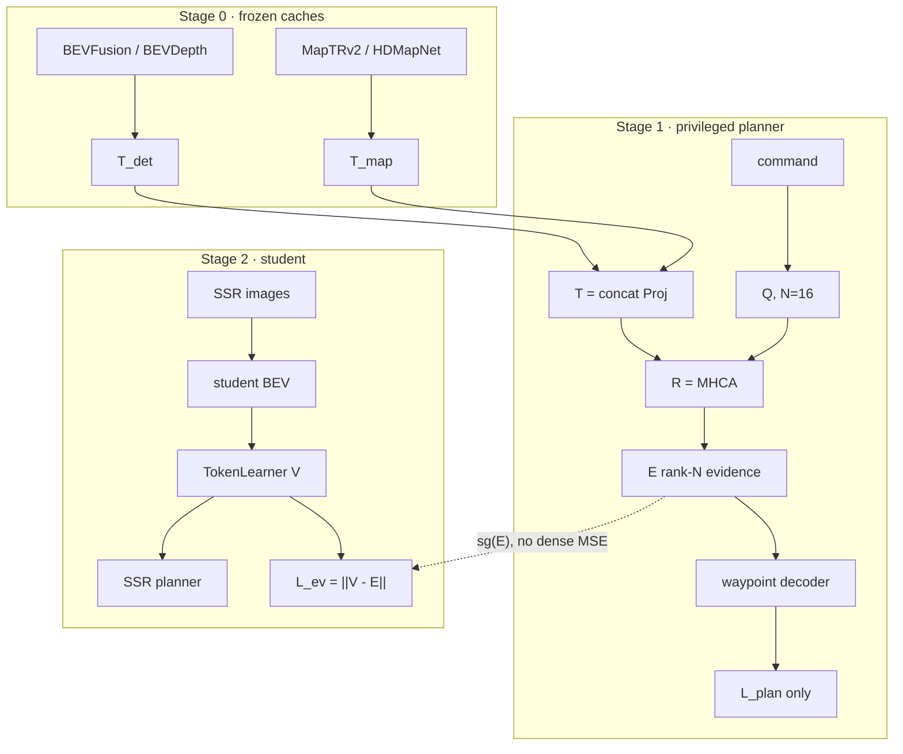

# Rank-N Privileged Evidence Distillation (RPED)

> Ask the memory, keep the answer in the tokens.
> 슬로건: **Ask, Don’t Imitate.**

이 문서는 adapter-MSE planning distill을 **대체하는** CVPR 방향이다.
기존 [PLANNING_DISTILLATION.md](PLANNING_DISTILLATION.md) 계약은 **dense KD
ablation**으로만 남긴다. 메인 방법은 이 파일이다.

## 1. 문제

SSR planner의 진짜 인터페이스는 100×100 BEV가 아니라 TokenLearner의 **16개
scene token**이다.

```text
images → BEVFormer 100×100×256 → navi_se(command)
      → TokenLearner 16 tokens → latent self-attn → waypoint cross-attn
      → 3-command × 6-step traj
```

PARA-SSR은 같은 BEV 위에 det/map/occ를 병렬로 올려 planning을 망가뜨렸다.

| 실행 | L2 MAX avg | CR box avg | 1s 손상 |
|---|---:|---:|---|
| SSR-noFFP | 0.737 | 0.221 | — |
| PARA-SSR | 1.000 | 0.514 | 가장 큼, `tok_sim` +63% |

원인: aux는 **command-invariant dense grid**를 만들고, planner는
**command-equivariant questions**를 던진다. Dense MSE / aux head는 Jacobian이
거의 full-rank라서 planner interface를 덮어쓴다. Adapter-MSE는 같은 실수를
teacher cache로 옮긴 것뿐이다.

- Stage 1 adapter는 zero-init residual MLP → identity에 가깝다.
- Stage 2는 student BEV를 teacher det/map BEV에 맞춘다. Planning-aware가 아니다.
- Distill 지점이 16 token이 아니라 dense BEV다.
- Command를 보지 않는다. 두 teacher MSE가 서로 다른 BEV 공간을 동시에 요구한다.

**Appearance matching** (`feature MSE ↓`)과 **planning-aware** (`val L2 /
1s box col ↓`)는 다른 일이다.

## 2. 방법

Aux teacher는 **memory**다. Student는 memory를 베끼지 않고, planner가 던지는
질문의 **답(evidence)** 만 가져온다.

$$
T = \mathrm{concat}\big(\mathrm{Proj}_{det}(T_{det}),\ \mathrm{Proj}_{map}(T_{map})\big)
$$

$$
Q = \text{command-conditioned planning queries},\quad N=16
$$

$$
E = R(Q, T) = \mathrm{MHCA}(Q, T)
$$

$$
V = \mathrm{Pool}(Q_s, S) = \text{student TokenLearner output}
$$

$$
\mathcal{L}_{ev} = \lVert V - \mathrm{sg}(E) \rVert^2
$$

Jacobian rank \(\le N\). Inference에서 \(T\)와 \(R\)을 버린다. FLOPs = SSR-noFFP.



### 설계 규칙

| 할 것 | 하지 말 것 |
|---|---|
| Distill \(V \approx E^\*\) | Distill \(Q \approx E^\*\) (질문은 질문으로 남긴다) |
| Same-question ablation은 \(R(Q_s, T)\) | Teacher TokenLearner \(Q_t\)를 따로 두지 않는다 |
| 두 teacher = 하나의 KV memory | Teacher별 dense MSE 두 개 |
| Stage 1 gate: privileged 16-token planner가 planning-only SSR을 이겨야 Stage 2 | Gate 없이 student 학습 |
| Dense/adapter MSE는 punchline ablation | RPED loss에 dense MSE를 auxiliary로 섞기 |
| Inference = vanilla SSR | Adapter / readout를 테스트 그래프에 남기기 |

메인 메트릭: **1s box collision**. L2는 auxiliary. 기계론 메트릭:
`gcos(plan, distill)`, Jacobian rank \(\approx 16\), `tok_sim`.

## 3. 코드 위치

| 역할 | 파일 |
|---|---|
| Memory / readout / \(\mathcal{L}_{ev}\) | [projects/mmdet3d_plugin/SSR/utils/planning_distill.py](../projects/mmdet3d_plugin/SSR/utils/planning_distill.py) (`TeacherMemoryProjector`, `PrivilegedEvidenceReadout`, `PrivilegedEvidenceDistillation`) |
| Stage 1 detector | [projects/mmdet3d_plugin/SSR/planning_distill_models.py](../projects/mmdet3d_plugin/SSR/planning_distill_models.py) (`PrivilegedReadoutPlanner`) |
| Student hook | [projects/mmdet3d_plugin/SSR/para_ssr.py](../projects/mmdet3d_plugin/SSR/para_ssr.py) — RPED면 `scene_query` / `pooled_query` / command를 넘김. Dense ablation은 기존 `PlanningDistillation` |
| TokenLearner 직후 \(V\) | [projects/mmdet3d_plugin/SSR/para_ssr_head.py](../projects/mmdet3d_plugin/SSR/para_ssr_head.py) `pooled_query` (latent decoder 전). `scene_query`는 decoder 후 fallback |
| CPU 테스트 | [tools/verify_rped.py](../tools/verify_rped.py) |

레거시 adapter-MSE (`PlanningBEVAdapter`, `CachedTeacherAdapterPlanner`)는
지우지 않는다. `E_dense` ablation이 그 경로다.

## 4. 실험 매트릭스

Gate: Stage 1 val L2 / 1s box col이 planning-only SSR보다 좋아야 Stage 2를 돌린다.
기존 adapter checkpoint를 RPED Stage 1이 통과하기 전에 재학습하거나 교체하지 않는다.

| ID | 무엇 | 명령 | 기대 |
|---|---|---|---|
| E0 | planning-only SSR | `./run.sh planonly 0,1` | 기준. 1s box col 최저 근처 |
| E1 Stage1 | privileged readout planner | `./run.sh rped-teacher 0,1` 후 `./run.sh eval-rped-teacher` | val L2가 E0을 이기면 통과 |
| E_rped | rank-N evidence distill | `./run.sh rped-distill 0,1` | 1s box col 회복, `gcos(plan,RPED)>0` |
| E_dense | adapter MSE on pair B | `./run.sh rped-dense 0,1` | PARA-SSR처럼 1s 손상. punchline |
| E_same_q | \(R(Q_s,T)\) | `./run.sh rped-same-question 0,1` | privileged Q보다 약하거나 비슷 |
| E_triplet | command triplet | `./run.sh rped-triplet 0,1` | command-equivariance |
| E_shuffle | batch-shuffle memory | `./run.sh rped-shuffle 0,1` | 회복이 사라짐. 아니면 prior matching |
| pair A | 25×25 BEVDepth+HDMapNet Stage 1 | `./run.sh rped-teacher-pair-a 0,1` | cache-pair ablation |

레거시 adapter 라인 (`teacher-bevfusion`, `distill-bevfusion-maptr`)은 E_dense의
Stage 1이다. RPED Stage 1과 섞지 않는다.

### 논문에 필요한 추가 측정 (학습 중 로그 / 별도 분석)

1. `gcos(plan, dense) < 0` vs `gcos(plan, RPED) > 0`, Jacobian rank \(\approx 16\)
2. Dense KD가 1s를 망치고 RPED가 회복
3. Stage 1 sufficiency gate
4. Same-question ablation
5. Command triplet
6. Shuffle / (추후) GT box-map memory
7. (추후) VAD ego-query generalization
8. Inference FLOPs = SSR-noFFP

## 5. 명령

캐시 전제: pair B train 28130 / val 6019 `.npz`. 없으면 `FileNotFoundError`.

```bash
# CPU 계약
./run.sh test

# Stage 1. 끝난 뒤 eval이 planning-only SSR을 이기면 Stage 2.
./run.sh rped-teacher 0,1
./run.sh eval-rped-teacher
# pair A (25x25 BEVDepth+HDMapNet) Stage 1 ablation
./run.sh rped-teacher-pair-a 0,1
./run.sh eval-rped-teacher-pair-a

# Stage 2 메인
./run.sh rped-distill 0,1

# Ablations (Stage 1 ckpt 재사용)
./run.sh rped-same-question 0,1
./run.sh rped-triplet 0,1
./run.sh rped-shuffle 0,1

# Punchline dense KD. 별도 adapter Stage 1 필요.
./run.sh teacher-bevfusion 0
./run.sh teacher-maptrv2 1
./run.sh rped-dense 0,1

# 학생 평가 (inference = vanilla SSR)
./run.sh eval $DISTILL_CKPT_OUT_ROOT/rped_student/epoch_12.pth 0 \
  projects/configs/SSR/RPED_SSR_student.py
```

환경 변수:

```text
DISTILL_CKPT_OUT_ROOT=/data2/byounggun/rideflux/pretrained_checkpoints/planning_distill_checkpoints
RPED_TEACHER_CKPT=$DISTILL_CKPT_OUT_ROOT/rped_teacher_bevfusion_maptrv2/epoch_6.pth
RPED_STUDENT_WORK_DIR=$DISTILL_CKPT_OUT_ROOT/rped_student
```

Pair B cache:

```text
/data3/byounggun/rideflux/pretrained_checkpoints/distill_bev_cache/{bevfusion,maptrv2}/cache_{train,val}_100x100/samples/<token[:2]>/<token>.npz
```

## 6. Checkpoint 계약

Stage 1 `PrivilegedReadoutPlanner` state dict 접두사:

```text
memory.projs.{bevfusion,maptrv2}.*
memory.teacher_embed.*
readout.query_embed.*
readout.navi_embedding.*
readout.layers.*
planner.*
```

Stage 2는 `memory.`와 `readout.`만 로드하고 freeze한다. `planner.*`는 버린다.
Student 학습 모듈은 image backbone + BEV encoder + SSR planning head뿐이다.

`query_source`:

- `privileged` (메인): \(E = R(Q_{priv}, T)\), \(V \approx E\). 질문은 student 것.
- `student` (ablation): \(E = R(Q_s, T)\). same-question.

## 7. 하지 말 것

- RPED 메인 loss에 dense MSE / adapter MSE를 더하지 않는다.
- Stage 1을 teacher별 독립 adapter job으로 쪼개지 않는다. 그건 레거시 라인이다.
- Stage 1 val이 planning-only SSR을 이기기 전에 Stage 2를 돌리지 않는다.
- `V` 대신 dense BEV를 distill하지 않는다.
- Inference graph에 readout을 남기지 않는다.
