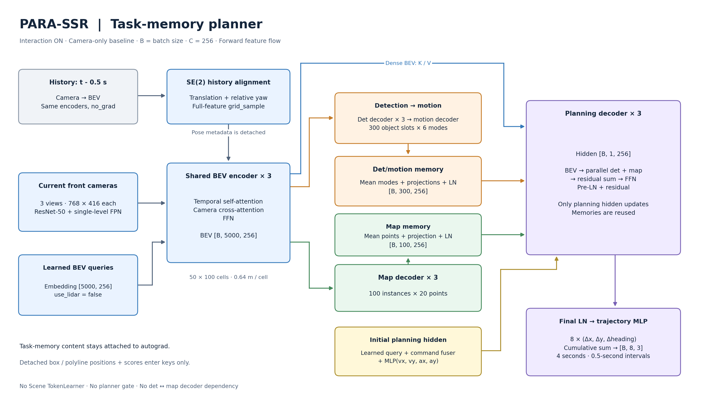
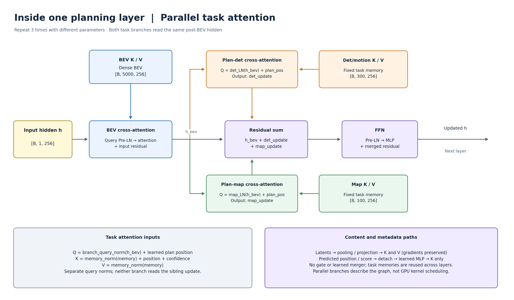

# PARA-SSR 최종 아키텍처: 구조도와 동작 설명

2026-09-15. 현재 NAVSIM `navsim/agents/para_ssr` 코드와 기본 학습 설정 기준이다.
`B`는 batch size, `C`는 feature 차원이며 기본값은 256이다.

## 1. 전체 구조

**카메라와 정렬된 과거 BEV로 하나의 공간 표현을 만들고, planner가 BEV를 읽은 뒤
det/motion·map latent를 병렬 분기로 읽어 미래 ego trajectory를 생성한다.**
현재 기본값은 `use_lidar=false`다.



[확대용 SVG](figures/17_task_memory_overview.svg).
화살표는 forward feature 전달 방향이다. 그림은 interaction on이며,
각 head의 prediction branch와 supervision loss는 아래 절에서 별도로 설명한다.

모델은 다음 세 부분으로 나뉜다.

1. **공유 BEV encoder:** 현재와 과거의 sensor 관측을 공통 공간 표현으로 만든다.
2. **Private perception heads:** det/motion과 map은 같은 BEV를 읽지만 서로의 출력을 입력으로
   받지 않는다. Detection→motion 연결은 원래 head 내부 구조를 유지한다.
3. **Planning decoder:** BEV와 두 head의 마지막 latent를 읽으며 planning hidden만 갱신한다.

이 문서에서 memory는 **이번 forward에서 만든 token 집합**이다. 장기 저장소나 별도의
과거 객체 track cache를 의미하지 않는다. 과거 frame 정보는 BEV의 temporal 경로에서 들어온다.

## 2. 입력과 shared BEV

| 항목 | 현재 기본 설정 |
|---|---|
| Frame | `[2, 3]`: 과거 0.5초 + 현재, 총 2 frame |
| Camera | `cam_f0`, `cam_l0`, `cam_r0`, frame마다 전방 3개 |
| Image | 원본 1920×1080 → 768×432 → 위쪽 16행 제거 → 768×416 |
| Camera encoder | ImageNet 사전학습 `resnet50.tv_in1k` + single-level FPN |
| LiDAR | 사용하지 않음 (`use_lidar=false`), point cloud 로드 없음 |
| 초기 BEV query | Learned embedding `[5000,256]` |
| Shared BEV | `[B, 256, 50, 100]` ↔ flatten 후 `[B, 5000, 256]` |
| BEV 범위 | SSR 좌표 `x_right ∈ [-32,32]`, `y_forward ∈ [0,32]` m |
| Cell | 0.64×0.64 m |
| BEV encoder | 3 layer |

현재 카메라 전용 설정은 learned BEV query table을 초기값으로 사용하며, calibration으로
각 BEV 위치에 해당하는 image feature를 읽는다. `lidar2img`는 카메라 투영 행렬의 기존
이름이며 point cloud 입력을 뜻하지 않는다. LiDAR encoder·cross-attention·gate는 만들지 않는다.

BEV encoder의 각 layer는 temporal self-attention → 정규화 → camera cross-attention
→ 정규화 → FFN → 정규화 순서다. 선택적 `use_lidar=true` 경로는 코드에 남아 있지만
현재 기본 실험에서는 사용하지 않는다.
BEV encoder 전체를 새 planner와 같은 Pre-LN 구조로 바꾼 것은 아니다.

Planning은 이 BEV를 직접 읽는다. 따라서 det/map memory로 요약되지 않은 공간 정보에도
접근할 수 있다. `use_stl=false`이므로 5,000개 BEV token을 Scene TokenLearner로 줄이는
경로는 사용하지 않는다.

## 3. 시간 정보: 과거 BEV를 먼저 이동·회전 정렬

과거 frame은 현재와 같은 image/BEV encoder 파라미터로 처리하지만 `no_grad`에서
계산한다. 만들어진 과거 BEV를 현재 ego 좌표계로 정렬한 뒤, 현재 frame의 TSA가 읽는다.

```text
과거 camera
    → 같은 encoder, no_grad
    → 과거 BEV
    → (Δx, Δy, Δyaw)로 전체 feature warp
    → 현재 encoder의 temporal self-attention
```

이 정렬은 learned ego MLP가 회전을 추측하도록 맡기는 방식이 아니라, 알려진 pose 변화로
샘플링 좌표를 직접 계산하는 방식이다.

- 이동: `bev_shift`, 현재 SSR frame에서 표현한 이동량을 ROI 크기로 정규화한 값.
- 회전: 기존 캐시의 `ego_motion[..., 2]`, 현재 heading − 과거 heading, radians.
- 회전 중심: BEV 사각형 중앙이 아닌 **ego 원점**. 현재 ROI에서는 정규화 좌표 `(0.5, 0)`이다.
- Sampling: bilinear `grid_sample`, `align_corners=False`, ROI 밖은 zero padding.
- 정렬을 한 뒤 TSA reference에 이동량을 다시 더하지 않는다.

현재 grid cell에서 과거 feature를 읽는 backward sampling 식은 다음과 같다.

```text
p_previous = R(Δyaw) · (p_current + translation_current)
```

이 식의 부호는 SSR의 `x=right, y=forward` 축과 current→previous sampling 방향에 따른다.
Pose는 detach한다. Warp 연산 자체는 feature gradient를 보존하지만, 기본 학습에서는
history encoder가 `no_grad`이므로 과거 activation까지 역전파하지 않는다.

SafeDrive와는 **과거 BEV 전체를 pose로 warp한다는 원리**가 같다. 현재 모델은 정렬 후 TSA로
융합하며, SafeDrive의 concat/convolution fusion을 그대로 옮긴 것은 아니다.

## 4. Ego status와 planning query

Planning query는 기본 **1개**다. 각 시점마다 query 8개를 두거나 command별 독립 query를
여러 개 두는 구조가 아니다. 하나의 planning hidden이 전체 8-step trajectory를 만든다.

```python
query = learned_plan_query              # [B, 1, 256]
command_embed = embedding(command_id)    # [B, 1, 256]
h0 = plan_fuser(cat(query, command_embed))
h0 = h0 + ego_status_encoder(ego_status).unsqueeze(1)
```

- Command: `left / straight / right / unknown`의 기존 4-way embedding.
- Fuser: `Linear(512,256) → LayerNorm → ReLU`.
- Ego status: 현재 `[vx, vy, ax, ay]`, NAVSIM 기본 축 `x=forward, y=left`와 물리 단위를 유지.
- Ego MLP: `Linear(4,256) → ReLU → Linear(256,256)`.
- Ego embedding은 첫 planner layer 전에 **한 번** 더한다.
- 별도 learned `plan_query_pos [1,256]`가 각 attention의 Q에 들어간다.
  이것은 ego의 실측 위치나 예측 waypoint 좌표가 아니다.

Ego 정보는 역할에 따라 갈라졌다.

| 정보 | 현재 경로 |
|---|---|
| 현재 속도·가속도 | Ego MLP → planning hidden |
| 주행 command | 기존 command embedding → planning hidden |
| Frame 간 이동·회전 | 기하학적 BEV warp |
| 기존 18차원 벡터 전체 | 캐시는 유지하되 learned BEV conditioning으로 사용하지 않음 |

따라서 현재 모델은 18차원 전체를 4차원 MLP로 압축한 모델이 아니다. 필요한 입력의 경로를
나눈 모델이다. 동시에, 과거 속도·가속도 등 기존 벡터의 모든 항목을 별도 학습 입력으로
보존했다고 해석해서도 안 된다. BEV의 legacy ego-motion MLP는 제거했다.

## 5. Det/motion memory

Detection decoder는 공유 BEV를 읽는 기존 3층 decoder이며 object query는 300개다.
300은 실제 객체 수가 아니라 **예측 slot 수**다. 배경에 해당하는 slot도 planner가 읽는다.

기존 motion decoder는 마지막 det hidden에 6개의 mode embedding을 더해
`300×6=1,800`개 token을 처리한다. 새 motion interaction은 추가하지 않았다.

```text
det_hidden     [B, 300, 256]
motion_hidden  [B, 300, 6, 256]
```

Planner용 memory는 다음과 같이 한 번 만든다.

```python
motion_summary = motion_hidden.mean(dim=2)       # [B, 300, 256]
det_memory = LN(
    det_projection(det_hidden)
    + motion_projection(motion_summary)
)                                                # [B, 300, 256]
```

같은 object slot의 det 표현과 motion 표현이 더해진다. Det는 위치·종류·형상 같은 현재
객체 상태를, motion은 가능한 미래 운동을 표현하도록 supervision을 받는다.
이는 latent에 기대하는 역할이며, 특정 channel에 그 의미가 명시적으로 배정된 것은 아니다.

평균하는 것은 **예측 궤적의 XY 좌표가 아니라 motion latent**다. 기존 motion prediction
branch는 6개 mode의 trajectory와 score를 계속 출력하고 학습한다. Planner에 전달하는
memory만 object당 1개로 줄인다. Top-1 mode, `traj_cls` 가중 평균, mode flatten+MLP는 없다.

Projection은 planner 차원을 맞추고 latent를 변환한다. 현재는 모든 C가 256이지만,
query/mode 수를 projection 차원에 hard-code하지 않는다.

## 6. Map memory

Map decoder는 기존 3층 구조다. 100개 instance 각각에 20개 point query가 있어,
decoder 내부에서는 총 2,000개 point token을 처리한다.

```python
map_point_hidden = ...  # [B, 100, 20, 256]
map_memory = LN(map_projection(map_point_hidden.mean(dim=2)))
# [B, 100, 256]
```

Point latent를 instance별로 평균해 planner가 읽을 map token 100개를 만든다.
실제 map prediction branch는 20점 polyline을 그대로 출력한다. 학습 target이나
map evaluation을 1점으로 바꾼 것이 아니다.

별도 LaneNet, 학습형 pooling, 20점 flatten MLP는 없다. Planner는 압축된 instance 표현을
읽으므로, 원래 point sequence를 직접 읽는 구조에 비해 순서 정보를 명시적으로 전달하지
않는다. 원래 map decoder의 point embedding과 supervision은 유지된다.

## 7. Content, position, confidence 분리

각 task memory에는 세 종류의 정보가 관여한다.

| 구분 | Det/motion | Map | Planning gradient |
|---|---|---|---|
| Content | Det hidden + 평균 motion hidden | 평균 map point hidden | Private decoder까지 전달 |
| Position 원본 | 예측 box center XY | 예측 polyline 20점 XY | MLP 입력 전에 detach |
| Confidence 원본 | 최대 foreground sigmoid score | 최대 foreground sigmoid score | MLP 입력 전에 detach |

Det XY는 metric SSR 좌표이므로 한 번 정규화한다.

```text
x_normalized = (x_right + 32) / 64
y_normalized = y_forward / 32
```

Map point는 head가 이미 `[0,1]`로 출력하므로 다시 정규화하지 않는다.
위치와 score의 embedding은 다음과 같다.

```python
det_position = det_xy_mlp(normalize(det_xy.detach()))
map_position = map_xy_mlp(map_points.detach()).mean(dim=2)

det_score = det_logits.detach().sigmoid().amax(-1, keepdim=True)
map_score = map_logits.detach().sigmoid().amax(-1, keepdim=True)
det_confidence = det_score_mlp(det_score)
map_confidence = map_score_mlp(map_score)
```

Map 위치는 **각 점을 MLP로 encoding한 뒤 평균**한다. 점 좌표부터 평균해 중심점 하나만
encoding하는 방식과 다르다. 다만 이 위치 embedding 자체는 point 순열에 불변이다.

`detach`는 raw coordinate와 score에 적용한다. **그 뒤 metadata MLP의 파라미터는 planning
loss로 학습된다.** Final prediction branch가 planning에 맞춰 좌표나 confidence를 직접
왜곡하는 gradient 경로는 끊고, perception latent와 planner 쪽 변환은 학습시킨다.

Confidence는 key embedding에 더한다. `log(score)` attention-logit bias, top-k,
confidence threshold, yaw/velocity metadata 추가는 적용하지 않았다.

## 8. Planner 1층과 세 층 반복



[확대용 SVG](figures/17_planning_layer.svg).

각 layer는 다음 순서로 hidden을 갱신한다.

```python
for layer in planner_layers:                 # 서로 다른 파라미터 3층
    h = h + layer.bev_cross_attention(h, bev)
    det_update = layer.plan_det_attention(h, det_memory)
    map_update = layer.plan_map_attention(h, map_memory)
    h = h + det_update + map_update
    h = h + layer.ffn(layer.ffn_norm(h))

h = final_layer_norm(h)
offsets = trajectory_head(h)
```

위 코드는 동작 순서의 의사 코드다. 실제 attention 입력은 아래와 같다.

```python
v = layer.memory_norm(memory)
q = layer.query_norm(h) + plan_query_pos
k = v + position_embedding + confidence_embedding
update = layer.cross_attention(q, k, v)  # 분기 출력, 합산은 두 task 계산 뒤 수행
```

BEV attention은 `k = LN(bev) + bev_pos`이며 confidence가 없다.

| Attention | Q가 사용하는 hidden | K/V의 content | 기본 attention score 크기/head |
|---|---|---|---|
| BEV | 이 layer에 들어온 h | Dense BEV 5,000개 | `1×5000` |
| Plan-det | BEV attention으로 갱신된 h | Det/motion memory 300개 | `1×300` |
| Plan-map | BEV attention으로 갱신된 h (plan-det과 동일) | Map memory 100개 | `1×100` |

BEV attention으로 먼저 공간 정보를 반영한다. 이후 plan-det과 plan-map은 같은
`h_bev`에서 갈라져 각각 객체·운동 정보와 map 정보를 읽는다. Query LN은 분기별로
다른 파라미터이므로 정규화 이후의 Q 값 자체가 항상 같다는 뜻은 아니다.
두 attention 결과를 `h_bev + det_update + map_update`로 합산한 뒤 FFN에 전달한다.
Gate·평균·추가 fusion MLP는 없다. 이 블록을 서로 다른 가중치로 3번 수행한다.

분기 독립성은 **같은 층 안에서** 성립한다. 다음 층은 앞 층에서 합산된 hidden을 읽으므로
이전 층의 두 task 정보가 모두 반영된다. Python 호출은 순서대로 기록될 수 있으며,
이 구조 변경이 GPU kernel의 동시 실행이나 속도 향상을 보장하지는 않는다.
기존 순차 구조와 parameter key/shape는 같지만 계산식은 달라졌으므로, 순차 checkpoint의
기존 결과를 재현하려면 당시 코드를 사용해야 한다.

각 layer의 query LN, memory LN, attention, FFN 파라미터는 독립적이다.
Memory를 만드는 projection/초기 LN과 metadata MLP는 planner 전체에서 한 번 사용한다.
따라서 memory 구성 LN과 layer별 K/V LN은 서로 다른 역할이다.

Residual은 이전 hidden을 보존하면서 attention/FFN 결과를 더한다. FFN은
`256 → 512 → 256`이고 attention head는 8개다. 마지막에는 Pre-LN residual stream을
`final LayerNorm`으로 정규화한 뒤 기존 trajectory regression MLP에 넣는다.

**Memory를 세 층에서 고정해 재사용한다는 것은 decoder를 학습하지 않는다는 뜻이 아니다.**
한 forward 안에서 planner가 det/map memory를 덮어쓰지 않는다는 뜻이다. Backward에서는
planning loss가 해당 memory를 만든 decoder까지 전달되어 다음 optimizer step에 반영된다.

## 9. Trajectory 출력

마지막 hidden `[B,1,256]`에서 query 축을 꺼내 기존 MLP로 24개 값을 예측한다.

```text
Linear(256,256) → ReLU
→ Linear(256,256) → ReLU
→ Linear(256,24)
→ [B,1,8,3] offsets
```

각 step은 NAVSIM ego 좌표의 `(Δx, Δy, Δheading)`이다. 현재 시점 기준 ego 좌표계에서
정의한 pose sequence의 차분이며, 매 waypoint의 heading으로 translation을 재회전하는
vehicle dynamics rollout이 아니다. 시간축 누적합으로 `[B,8,3]` trajectory를 만든다.
Horizon은 4초, 간격은 0.5초다.

외부 계약은 다음과 같이 유지한다.

- `ego_fut_preds`: `[B,4,8,3]`.
- `trajectory`: `[B,8,3]`.

여기서 4는 기존 command-branch API를 위한 차원이다. **지금은 command로 조건화된
한 trajectory를 이 축으로 expand한다. 독립적인 미래 후보 4개를 생성하는 모델은 아니다.**
Command가 입력에서 달라지면 hidden과 예측 trajectory가 달라질 수 있다.

`scene_query`라는 내부 호환용 이름도 남아 있지만, 이는 최종 planning hidden을 반환하는
이름이다. Scene TokenLearner나 scene-token 경로가 다시 실행되는 것은 아니다.

## 10. 학습과 gradient

Interaction on에서는 train/eval 모두 현재 BEV의 det/motion·map decoder를 실행한다.
위치와 score가 필요하므로 prediction branch도 실행한다. Forward 자체에 GT는 필요하지
않으며, matching은 명시적인 loss 계산에서만 한다.

총 supervision은 다음과 같다. 각 `L`에는 기존 head 내부의 세부 loss weight가 포함된다.

```text
L_total = 2 L_plan + L_det + L_motion + L_map
```

Planning은 command와 valid-step mask를 적용한 trajectory offset L1이며,
heading 오차는 주기적으로 wrap하고 기존 heading weight 0.5를 유지한다.
Det/motion은 기존 classification/box/trajectory/mode supervision,
map은 기존 classification/point/direction supervision을 유지한다.

Interaction on의 planning gradient는 세 경로를 합친다.

```text
L_plan → planner → BEV → 현재 encoder
L_plan → planner → det/motion memory → det/motion decoder → BEV → 현재 encoder
L_plan → planner → map memory → map decoder → BEV → 현재 encoder
```

Forward에서 det/map private decoder 사이에 새 연결은 없다. 하지만 shared BEV를 함께
학습하고 planner의 joint loss를 받으므로, **학습 목적까지 서로 완전히 독립적이라고 볼 수는
없다.** 새 구조가 지키는 독립성은 perception decoder의 forward dependency에 관한 것이다.

기존 decoder 입력의 `_ScaleGrad`는 제거했다. 그 위치에서 gradient를 줄이면 head를
통과한 planning gradient까지 줄어들기 때문이다. 현재는 loss 출처별로 BEV gradient를
구분해서 보정한다.

```text
g_BEV = ∇BEV(2 L_plan)
      + s_det ∇BEV(L_det + L_motion)
      + s_map ∇BEV(L_map)
```

Planning 항에는 직접 경로와 두 memory 경유 경로가 모두 포함된다. Det와 motion은 합친 뒤
미분한다. Private head 파라미터는 원래 supervision과 planning gradient를 받고,
`s_det`, `s_map`은 **shared BEV로 들어가는 auxiliary gradient**에만 적용한다.

기본 목표 norm share는 plan 0.4 / det+motion 0.3 / map 0.3이다. 이는 loss weight 비율이나
성능 비율이 아니며, EMA/clamp/갱신 간격 때문에 매 batch의 실제 share가 정확히 같지는 않다.
첫 10,600 microbatch는 warm-up이고 이후 200 microbatch 간격으로 계수를 갱신한다.
AMP에서는 보정 상쇄 오차가 확인되어, **GradBalancer 활성 학습은 FP32를 요구**한다.

## 11. 지원하는 세 학습 모드

| 항목 | Interaction (`ssr`) | Parallel (`parallel`) | Planning only (`plan`) |
|---|---|---|---|
| Shared sensor/BEV encoder | 동일 | 동일 | 동일 |
| Ego planning 입력/BEV warp/final LN | 동일 | 동일 | 동일 |
| Planner block | BEV→(det ∥ map)→합산→FFN | BEV→FFN | BEV→FFN |
| Planner layer 수 | 3 | 3 | 3 |
| Det/motion·map head | 있음 | 있음 | 없음 |
| Plan-det/plan-map 파라미터 | 있음 | 없음 | 없음 |
| Planning loss→private decoder | 연결 | 연결 없음 | Decoder 없음 |
| 학습 supervision | plan+det+motion+map | plan+det+motion+map | plan |
| 기본 eval에서 auxiliary decoder | 반드시 실행 | 생략 가능 | 없음 |
| GradBalancer | 사용 | 사용 | 사용하지 않음 |

Interaction과 parallel은 perception supervision을 유지하면서 planner가 task memory를
직접 읽는 효과를 비교한다. 이때 interaction module의 파라미터와 추론 비용도 함께 늘어난다.
Parallel과 planning-only는 같은 BEV-only planner에 auxiliary task supervision을 추가한
효과를 비교한다. Parallel은 PARA-Drive와 같은 공유 encoder·병렬 head의 원리를 따르지만,
논문의 전체 architecture나 recipe를 그대로 복제한 것은 아니다.

Interaction off는 attention 결과에 0을 곱하는 구현이 아니다. 해당 attention·projection·
metadata MLP를 생성하지 않는다. 따라서 checkpoint를 읽을 때도 학습과 같은 mode가 필요하다.

## 12. 의도한 장점과 남는 tradeoff

현재 구조는 dense 공간 정보, 객체·운동 표현, map instance 표현을 planning에 함께 제공한다.
Perception head를 서로 연결하지 않고 planning query에 정보가 모이도록 만들어,
task interaction 추가 지점을 두 종류로 제한했다.

그러나 구조만으로 성능 향상을 보장할 수는 없다.

- 평균 pooling은 memory를 작게 만들지만 mode 차이와 명시적인 point 순서 표현을 압축한다.
- 배경 object/map slot도 모두 attention 대상이며, confidence는 hard filtering이 아니다.
- Interaction inference는 기존 auxiliary decoder 전체를 실행하므로 비용이 늘어난다.
  Planning query가 1개여도 K/V projection 및 1,800 motion/2,000 map token decoder 비용은 남는다.
- BEV GradBalancer는 private decoder 내부의 planning/perception gradient 충돌까지 해결하지 않는다.
- SE(2)는 ego 운동을 보상한다. 객체 자체의 운동, ROI 밖 history 부재와 반복 interpolation의
  한계는 temporal 모델이 별도로 감당한다.

세 모드의 최종 PDMS/EPDMS/auxiliary mAP와 추론 비용을 함께 비교해야 실제 효과를 판단할 수 있다.
누적 구현·테스트는 [14번 문서](14_task_memory_planner.md), 최근 코드 감사와 수정은
[16번 문서](16_code_audit.md)에 정리되어 있다.

## 코드와 그림 원본

| 동작 | 구현 |
|---|---|
| Forward 순서, history no_grad | [`para_ssr_model.py`](../navsim/agents/para_ssr/para_ssr_model.py) |
| Shared BEV와 sensor fusion | [`bevformer.py`](../navsim/agents/para_ssr/modules/bevformer.py) |
| SE(2) warp | [`temporal_alignment.py`](../navsim/agents/para_ssr/modules/temporal_alignment.py) |
| Memory, metadata, planner, final LN | [`planner_head.py`](../navsim/agents/para_ssr/modules/planner_head.py) |
| Det/motion latent | [`det_motion_head.py`](../navsim/agents/para_ssr/modules/det_motion_head.py) |
| Map latent | [`map_head.py`](../navsim/agents/para_ssr/modules/map_head.py) |
| Loss와 BEV gradient 조정 | [`para_ssr_loss.py`](../navsim/agents/para_ssr/para_ssr_loss.py), [`grad_balance.py`](../navsim/agents/para_ssr/modules/grad_balance.py) |
| 기본 크기/설정 | [`default.py`](../navsim/agents/para_ssr/configs/default.py) |

그림은 [렌더링 스크립트](figures/render_task_memory_architecture.py)로 PNG와 SVG를 함께 생성한다.
모델 import나 GPU 연산을 사용하지 않는다.

```bash
python report/figures/render_task_memory_architecture.py
```
